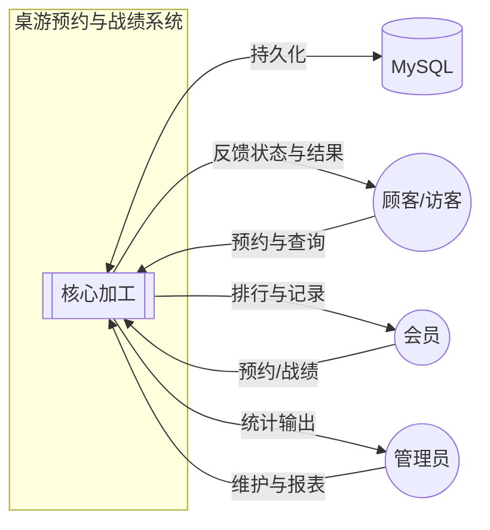
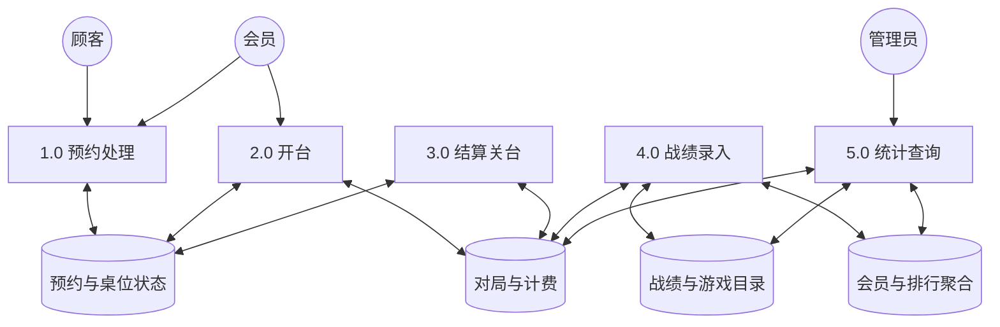
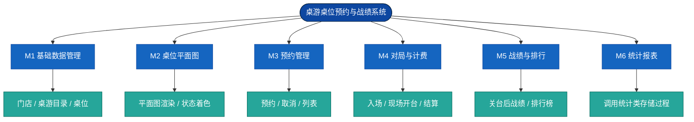
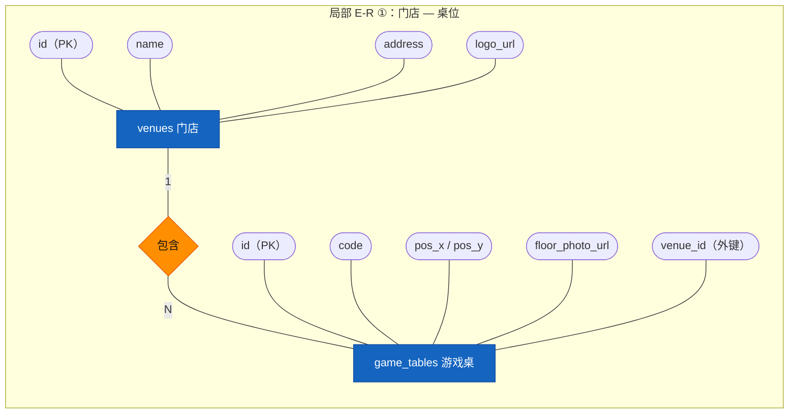
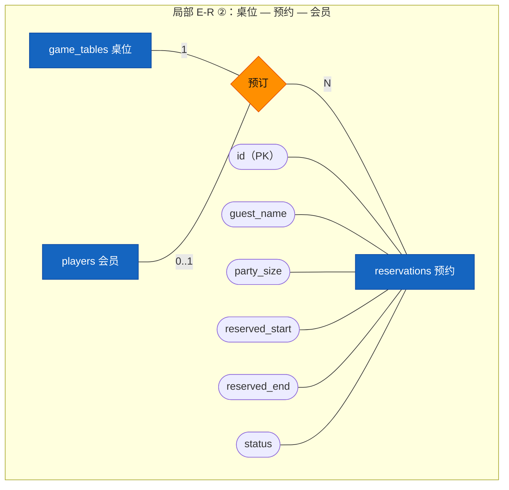
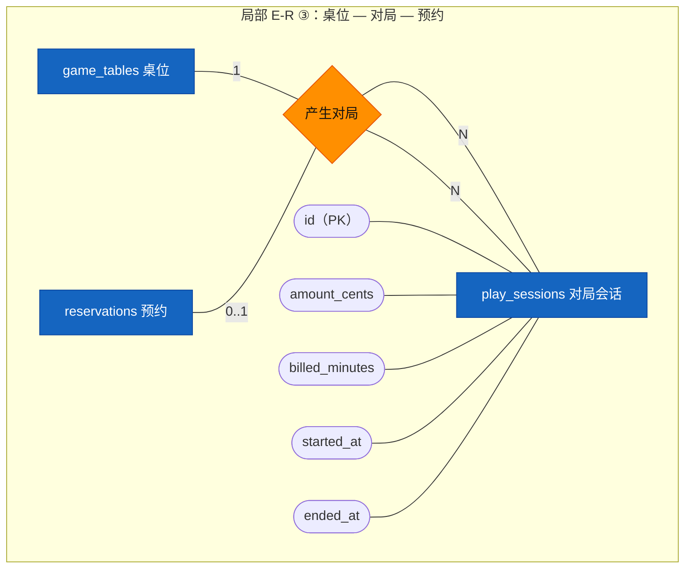
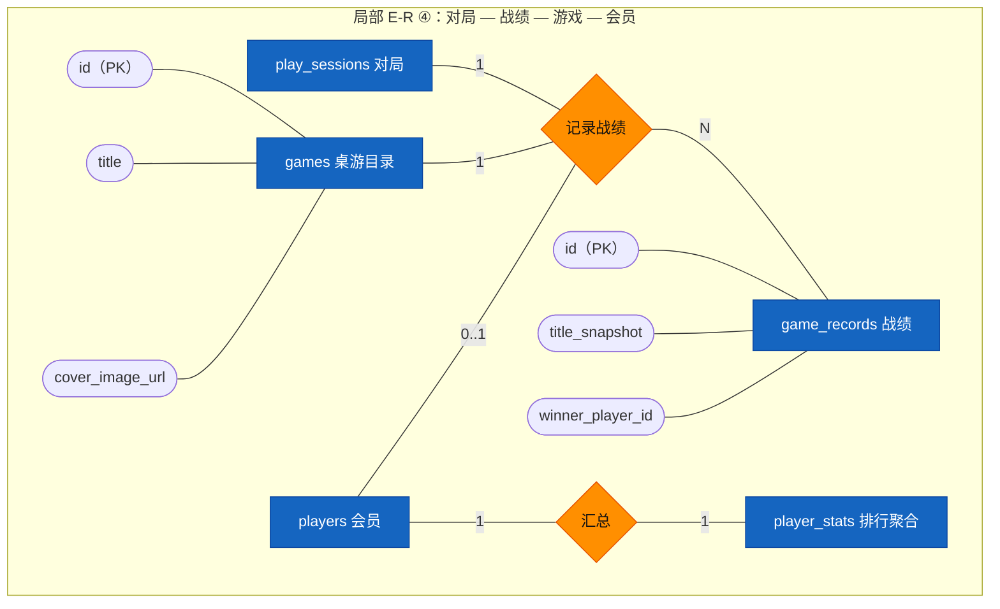
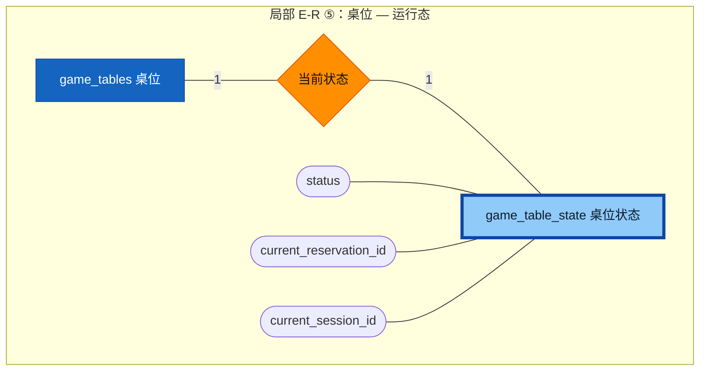
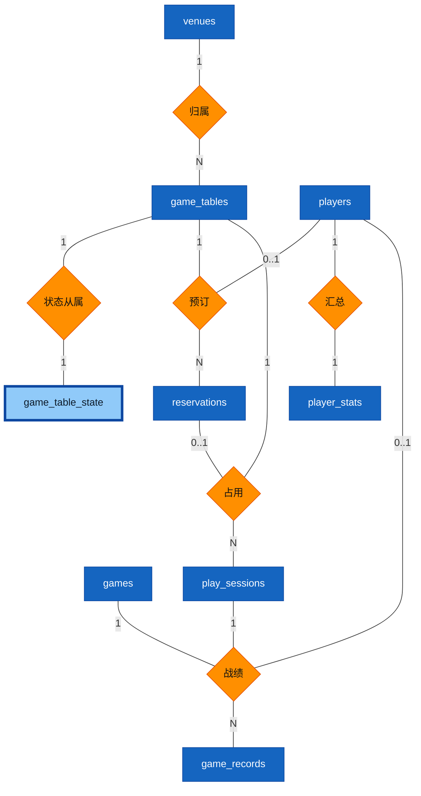

# 数据库设计与实现文档

---

## 封面（课程设计）

| 项目 | 内容 |
|------|------|
| **课程设计题目** | 桌游桌位预约与战绩管理系统 — 数据库设计与实现 |
| **学号** | 【请填写】 |
| **姓名** | 【请填写】 |
| **指导教师姓名** | 【请填写】 |
| **设计完成日期** | 【请填写： 年 月 日】 |

---

## 一、选题说明及需求介绍

### 1.1 选题背景

桌游门店需管理 **桌位资源**、**顾客预约**、**开台计时与结算**、**战绩登记** 与 **会员排行** 等。若缺乏统一数据模型，易出现 **时段冲突、桌位状态与现场不一致、统计困难** 等问题。本设计采用 **MySQL 8** 作为后台数据库，以 **E-R 概念模型** 指导逻辑结构与物理实现，并通过 **完整性约束、触发器、存储过程、视图、索引与分级权限** 保障数据质量与安全。

### 1.2 需求介绍

1. **场地与桌位**：维护门店及桌位编号、平面图坐标；支持门店 LOGO、桌位实景等 **URL** 类多媒体引用。  
2. **预约**：桌位时段预约；**不重叠**、**占用不可约**；可取消。  
3. **对局**：预约入场或现场开台；关台结算（时长、金额）。  
4. **战绩与目录**：桌游 **目录**（封面图、规则 PDF 等 URL）；关台后按目录录入战绩；**排行榜** 自动汇总。  
5. **统计**：日收入、游戏热度、桌位利用率等，供管理查询。

---

## 二、系统的功能模块划分

### 2.1 功能需求分析

| 模块 | 功能需求 |
|------|----------|
| M1 基础数据 | 门店、桌游目录、桌位主数据及 URL 维护 |
| M2 桌位平面图 | 空闲 / 预约中 / 占用可视化 |
| M3 预约 | 新建、冲突检测、取消、列表查询 |
| M4 对局计费 | 入场开台、现场开台、结算关台 |
| M5 战绩排行 | 战绩写入、触发器维护聚合、排行榜视图 |
| M6 统计报表 | 存储过程支撑收入与利用率等分析 |

### 2.2 数据流图（DFD）分析

**上下文（0 层）**：系统与顾客、会员、管理员、数据库之间的数据流。

**1 层分解**：加工与数据存储的逻辑划分。

### 2.3 软件功能模块图

按 **自顶向下** 划分的软件功能结构（与前后端子系统对应；颜色仅用于阅读区分）。

---

## 三、数据库概念结构设计

### 3.1 E-R 图基本要素与符号规范（本设计约定）

以下约定与 **Peter Chen E-R 表示法** 及课程常见规范对齐；图中使用 **颜色** 区分图元类型（导出 Word 时建议保留彩色矢量或 PNG）。

| 图元类型 | 几何形状 | 颜色（本图） | 说明 |
|----------|------------|--------------|------|
| **实体（强实体）** | 矩形 | 蓝色系 | 可独立存在、有标识符的事物 |
| **弱实体 / 强依赖实体** | 矩形 + **加粗边框**（双实线语义） | 浅蓝系 | 依赖其它实体存在，如「桌位运行态」依赖桌位 |
| **属性（简单）** | 椭圆（Mermaid 用体育场形 `([ ])` 近似） | 紫色系 | 描述实体特征 |
| **主键属性** | 同椭圆，标注 **PK** 或名称下加下划线（排版时） | 紫色系偏深 | 唯一标识实体 |
| **多值 / 派生** | 本系统未单独建模多值属性；派生量（如排行）由聚合表+触发器维护 | — | 若扩展可用双椭圆 / 虚线椭圆 |
| **联系** | **菱形** | 橙色系 | 实体间关联，命名用动词或动宾短语 |
| **联系属性** | 连在菱形上的椭圆 | 紫色系 | 本设计中部分联系属性并入 N 端关系模式 |
| **基数** | 写在 **实体—菱形** 连线上 | — | 标注 **1**、**N** 或 **0..1** 等 |
| **概化（继承）** | 倒三角形 + 分支 | — | 本系统 **未** 采用「用户←会员/访客」类概化；若扩展可用 **○|○** 表示部分/全部概化 |

**命名规则**：实体名使用英文表名语义或中文注释；联系名简短中文；属性名与逻辑结构一致（小写 + 下划线风格与 MySQL 列名一致）。

---

### 3.2 局部 E-R 图

#### 局部① 门店 — 桌位（含属性与 1:N 基数）

#### 局部② 桌位 — 预约 — 会员（参与）

**基数说明**：一桌 **1** 对多 **N** 条预约记录；会员对预约为 **0..1**（允许仅填写访客称呼而不选会员）。

#### 局部③ 桌位 — 对局会话 — 预约（可选参与）

#### 局部④ 对局 — 战绩 — 游戏目录 — 会员（胜者）

**说明**：`player_stats` 与会员为 **1:1** 聚合关系；战绩写入后由库内机制更新聚合（概念上可理解为联系「汇总」）。

#### 局部⑤ 桌位运行态（弱实体风格）

---

### 3.3 全局 E-R 图（实体 + 联系 + 基数概览）

全局图强调 **实体间联系与基数**；各实体详细属性见 **§3.2 局部图**。颜色规范同 §3.1。

---

## 四、数据库逻辑结构设计

### 4.1 E-R 模型向关系模式的转换

| 概念对象 | 关系模式 | 主要依据 |
|----------|----------|----------|
| 实体 `venues` | `venues(id, name, address, logo_url, …)` | 实体直接成表 |
| 实体 `games` | `games(id, title, cover_image_url, …)` | 同上 |
| 实体 `game_tables` | `game_tables(id, venue_id, code, …)` | 联系「归属」**1:N** → `venue_id` 外键放入 N 端 |
| 弱实体风格 `game_table_state` | `game_table_state(table_id PK/FK, status, …)` | **1:1** 依赖 `game_tables`，主键即外键 |
| 实体 `players` | `players(id, display_name, …)` | 实体成表 |
| 联系「汇总」**1:1** | `player_stats(player_id PK/FK, wins, games, …)` | 与 `players` 一对一扩展 |
| 联系「预订」 | `reservations(id, table_id, player_id, …)` | **N** 端独立表，含两端外键 |
| 后台账号 | `app_users(id, username, password_hash, role, …)` | 保存登录账号与角色，密码仅保存加盐哈希 |
| 登录会话 | `auth_sessions(id, user_id, token_hash, expires_at, …)` | 保存会话 token 哈希，支持退出与过期控制 |
| 联系「占用/产生对局」 | `play_sessions(id, table_id, reservation_id, …)` | `reservation_id` 可为空表示现场开台 |
| 联系「战绩」 | `game_records(id, session_id, game_id, title_snapshot, …)` | 含 `game_id` 与历史快照字段 |

### 4.2 规范化处理（至 3NF）

1. **1NF**：字段原子；复杂分数字段用 `JSON` 单列表示，避免重复组。  
2. **2NF**：无非主属性对主键的部分依赖。  
3. **3NF**：消除传递依赖；`title_snapshot` 为 **面向历史的受控冗余**（由存储过程写入），避免目录改名破坏历史语义，已在需求中说明。

---

## 五、系统实现过程及完成效果介绍

### 5.1 数据库完整搭建过程

1. 安装 **MySQL 8**，字符集 **utf8mb4**。  
2. 创建库与用户（`db/bootstrap.sql`、`db/create-app-user.sql`）。  
3. 按序执行 `db/init/01_schema.sql`～`06_security_grants.sql`（详见下表）。  
4. 配置应用连接串（`server/.env`），启动 API 与前端联调。

| 文件 | 内容 |
|------|------|
| `01_schema.sql` | 表、**主键/外键**、**索引**、**CHECK**、**触发器** |
| `02_procedures.sql` | **存储过程**（预约、开台、结算、战绩及统计类） |
| `03_seed.sql` | 基础种子数据 |
| `04_views.sql` | **视图**（排行榜、账单明细、游戏热度、平面图查询等） |
| `05_bulk_seed.sql` | 大量测试数据 |
| `06_security_grants.sql` | **安全性**：演示用只读账号与受限应用账号（`GRANT` 最小权限） |

### 5.2 完整性控制（实现效果）

- **实体完整性**：主键、`AUTO_INCREMENT`。  
- **参照完整性**：外键约束；删除策略按表语义（如战绩随会话级联）。  
- **用户定义完整性**：`ENUM`、`CHECK`（预约时段、金额上界等）。  
- **业务一致性**：**触发器** 维护桌位占用/释放、`player_stats` 与战绩插入联动。

### 5.3 前台功能与后台数据库对象对应（效果）

| 前台功能 | 后台主要支撑 |
|----------|----------------|
| 平面图着色 | 视图 `v_table_status_floor` + 表 `game_table_state`；触发器同步状态 |
| 预约 / 取消 | 存储过程 `sp_reserve_table`、`sp_cancel_reservation` |
| 入场 / 现场开台 | `sp_checkin_start_session`、`sp_start_walkin_session` + 触发器占桌 |
| 结算关台 | `sp_end_session_settle` + 触发器释桌 |
| 关台后录入战绩 | `sp_insert_game_record` + 触发器更新排行聚合 |
| 排行榜 / 报表 | 视图 `v_leaderboard`；过程 `sp_report_*` |

### 5.4 完成效果简述

在浏览器中可完成 **注册/登录 → 预约 → 开台 → 结算 → 录入战绩 → 查看排行榜** 的闭环演示；数据库侧可验证 **触发器、存储过程、视图、索引、权限脚本** 均已按 SQL 脚本创建，满足课程设计「后台完整、前台有对应功能」的要求。

---

## 六、总结（感想与收获）

### 6.1 与预期目标的符合情况及系统特点

本系统实现了选题预定的 **预约—对局—结算—战绩—排行** 主线，与预期目标 **相符**。特点包括：**（1）** 库内对象齐全（表、视图、索引、触发器、过程、测试数据、权限示例）；**（2）** 桌位状态与战绩聚合尽量由 **触发器/过程** 保证，减轻应用层负担；**（3）** 使用 **URL** 字段承载图片与文档引用，符合实际系统做法。

### 6.2 存在的问题与有待提高之处

- 预约 **到期自动取消**、消息通知等尚未实现。  
- 战绩若支持 **多人一队、多局计分**，需增加中间表以进一步强化规范化。  
- 生产环境应拆分 **测试数据脚本** 与 **正式迁移**，并配合备份与审计。

### 6.3 经验与收获

通过本次设计，巩固了 **从需求到 E-R、再到关系模式与 SQL 实现** 的完整链路；体会到 **基数与联系** 画清楚后，外键与过程边界自然清晰；同时认识到 **文档符号规范** 与 **实现命名一致** 对团队协作与验收的重要性。

---

## 七、参考资料

1. MySQL 8.0 Reference Manual. https://dev.mysql.com/doc/refman/8.0/en/  
2. 王珊, 萨师煊. 《数据库系统概论（第 5 版）》. 高等教育出版社.  
3. Peter Chen. The Entity-Relationship Model—Toward a Unified View of Data.（E-R 经典文献，概念参考）  
4. **本项目数据库脚本（设计产出，随仓库提交）**  
   - `db/bootstrap.sql`  
   - `db/create-app-user.sql`  
   - `db/init/01_schema.sql`  
   - `db/init/02_procedures.sql`  
   - `db/init/03_seed.sql`  
   - `db/init/04_views.sql`  
   - `db/init/05_bulk_seed.sql`  
   - `db/init/06_security_grants.sql`  
5. `docs/数据库设计说明.md`、`docs/数据库实施与维护计划.md`

---

## 八、致谢

在本次课程设计的资料查阅、需求梳理、数据库脚本联调与文档撰写过程中，**【指导教师姓名】** 给予了耐心指导；同学们在环境配置与测试数据验证方面也提供了帮助。在此一并致以诚挚谢意。因水平与时间所限，疏漏之处恳请老师批评指正。

---

**排版提示**：导出 Word 时，可将 Mermaid 图在 [Mermaid Live Editor](https://mermaid.live) 中渲染为 **彩色 PNG** 插入，以保证「矩形 / 菱形 / 椭圆 / 基数 / 颜色」在纸质稿中清晰可辨；封面与 **PK 下划线** 可在 Word 中按学校模板二次美化。
