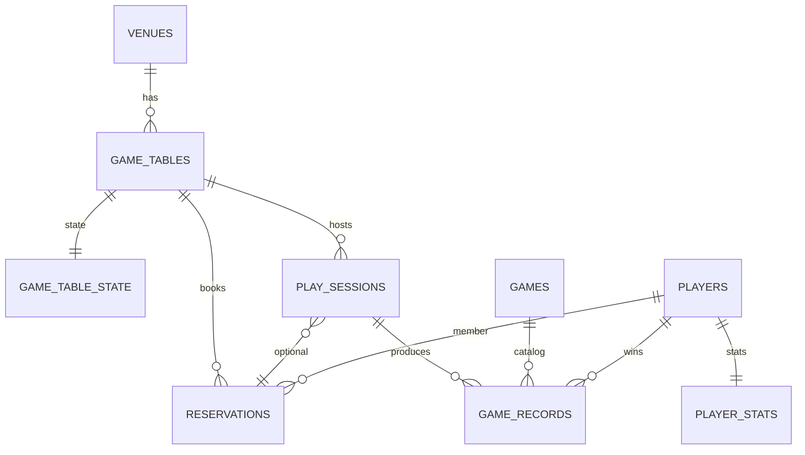

# 数据库设计说明（E-R 与关系模式）

## 1. 业务概述

本系统支撑桌游门店的 **桌位预约 → 开台计时 → 结算 → 战绩录入 → 排行榜** 全流程，并在库内通过 **外键、CHECK、触发器、存储过程、视图** 保证一致性与可统计性。

## 2. E-R 图（概念模型）

## 3. 关系模式（逻辑结构，3NF 说明）

| 关系 | 主键 | 主要外键 | 说明 |
|------|------|----------|------|
| `venues` | `id` | — | 门店；`logo_url` 存图片外链 |
| `app_users` | `id` | — | 后台登录账号；`password_hash` 保存加盐哈希 |
| `auth_sessions` | `id` | `user_id→app_users` | 登录会话；仅保存 token 哈希和过期时间 |
| `games` | `id` | — | 桌游目录；`cover_image_url`、`rules_pdf_url` 存图片/PDF 外链 |
| `game_tables` | `id` | `venue_id→venues` | 桌位；`floor_photo_url` 可选实景图 URL |
| `game_table_state` | `table_id` | `table_id→game_tables` | 运行态（空闲/预约/占用），由触发器与存储过程协同更新 |
| `players` | `id` | — | 会员；`avatar_url` 头像 URL |
| `player_stats` | `player_id` | `player_id→players` | 胜场/局数聚合；插入会员时触发器建行，写入战绩时触发器累加 |
| `reservations` | `id` | `table_id`、`player_id` | 预约；包含 `party_size` 人数，`CHECK(reserved_end>reserved_start)` |
| `play_sessions` | `id` | `table_id`、`reservation_id` | 对局与计费；金额 CHECK 防异常大数 |
| `game_records` | `id` | `session_id`、`game_id`、`winner_player_id` | 战绩；`title_snapshot` 为落库时游戏名快照，避免目录改名破坏历史（允许受控冗余） |

规范化要点：游戏名以 `games` 为权威来源；历史展示依赖 `title_snapshot` 与 `game_id` 双锚定，兼顾 **3NF（事实依赖游戏实体）** 与 **运营可追溯性**。

## 4. 数据库对象清单（均由 `db/init/*.sql` 创建）

- **索引**：各表外键列、时间窗查询列、状态列组合索引（见 `01_schema.sql`）。
- **触发器**：`tr_players_after_insert_stats`、`tr_play_sessions_after_insert_state`、`tr_play_sessions_after_update_release`、`tr_game_records_after_insert_stats`。
- **存储过程**：预约/开台/结算/战绩业务过程 + `sp_report_daily_revenue`、`sp_report_game_popularity`、`sp_report_table_utilization` 统计查询。
- **视图**：`v_leaderboard`、`v_session_billing_detail`、`v_game_catalog_with_stats`、`v_table_status_floor`。
- **安全脚本**：`06_security_grants.sql` 演示只读账号与受限应用账号（生产请替换强口令）。

## 5. 测试数据

- `03_seed.sql`：门店、游戏目录、桌位、示例会员。
- `05_bulk_seed.sql`：批量会员约 66 条、历史已结算会话与战绩约 360 条，用于验证统计类过程、视图和推荐算法。
