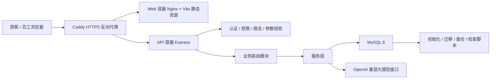

# 骰子猫桌游馆系统产品功能说明书

## 1. 项目概述

骰子猫桌游馆系统是一套面向单店桌游馆的经营管理平台。它同时服务两类用户：

- 顾客：在线预约桌位、查看桌游目录、查看我的预约、提交战绩、咨询 AI 导购。
- 店长/员工：处理预约、开台、会员、桌游目录、租借副本、员工权限、经营数据和 AI 建议。

项目当前定位是“单店可部署、可维护、可答辩演示”的企业级单体系统。系统不追求微服务和复杂多租户，而是优先把真实门店的一条经营链路做完整：顾客预约进入系统，员工处理到店和运营，店长通过数据总览和 AI 经营大脑做决策。

## 2. 产品价值

传统桌游馆常见问题：

- 预约靠微信或电话记录，容易冲突和遗漏。
- 桌游目录散落在线下清单，顾客不知道适合玩什么。
- 会员、储值、积分、租借和战绩分散管理。
- 店长很难实时知道今天收入、空桌、逾期租借和热门桌游。
- AI 如果只是聊天框，容易出现“帮你预约成功”这类幻觉。

本系统的解决思路：

- 用数据库统一管理桌位、预约、会员、桌游、租借和订单。
- 顾客端直接完成预约前的信息选择和查询。
- 后台给员工处理门店日常流程，给店长查看经营总览。
- AI 先调用确定性工具查询数据库，再生成建议，不直接执行写操作。
- 用 Docker、Caddy、健康检查、迁移和备份脚本支撑公网部署。

## 3. 技术架构



技术栈：

- 前端：Vanilla JS、Vite、Tailwind、DaisyUI、ECharts。
- 后端：Express、mysql2、Zod、Helmet、express-rate-limit、Pino。
- 数据库：MySQL 8，包含表、视图、存储过程、触发器和迁移记录。
- 部署：Docker Compose、Caddy、Nginx、Node API、MySQL。
- AI：OpenAI 兼容接口，配合后端工具查询层。

目录结构说明：

```text
server/src/
  index.js                 Express 入口，中间件、静态挂载、监听
  routes/                  按业务域拆分 API
  services/                预约维护、AI 工具层等复杂逻辑
  auth.js security.js      登录态、密码哈希、权限校验
  db.js logger.js audit.js 数据库、日志、审计

web/src/
  main.js                  SPA 页面组织与事件绑定
  api.js state.js          请求封装和全局状态
  components/              Toast 等通用组件

db/
  init/                    空库初始化
  migrations/              结构演进迁移

scripts/
  db-check.mjs             数据库一致性检查
  db-backup.mjs            数据库备份
  predeploy-check.mjs      部署前检查

deploy/
  docker-compose.prod.yml  生产编排
  Caddyfile                HTTPS 和反向代理
```

## 4. 公网部署能力

系统支持公网服务器部署，推荐流程：

```bash
cd /opt/boardgame-system
git pull origin main
docker compose -f deploy/docker-compose.prod.yml --env-file deploy/.env.prod up -d --build
docker compose -f deploy/docker-compose.prod.yml --env-file deploy/.env.prod exec api npm run demo:seed
```

部署后访问：

- 顾客端：`https://lhywork.top/`
- 后台端：`https://lhywork.top/admin`
- 健康检查：`https://lhywork.top/api/health`

部署组件：

- Caddy：自动 HTTPS、反向代理 `/api` 和前端页面。
- Web：构建后的 Vite 静态资源。
- API：Express 接口服务。
- MySQL：业务数据库，持久化 volume 保存。

## 5. 顾客端功能

### 5.1 首页与预约入口

顾客打开网站根路径后，首先看到预约界面。页面不是营销落地页，而是直接进入可用功能：选择人数、时间、登录账号、查看排行榜、查看租借和浏览桌游目录。


功能点：

- 填写姓名、电话、人数、到店时间、离店时间。
- 后端根据桌位容量和预约冲突判断是否可预约。
- 可查看店内排行榜、桌游租借和桌游目录。
- 顾客登录后可查看“我的预约”。
- 页面默认连接真实后端，后端不可用时才显示降级提示。

### 5.2 顾客账号

顾客可以注册和登录自己的账号。系统使用手机号作为登录入口，密码通过后端哈希存储，不在前端保存明文密码。

演示账号：

```text
手机号：19900061001
密码：demo12345
```

顾客登录后可以：

- 查看自己的预约记录。
- 看到预约状态和桌位信息。
- 在对应预约/开台后提交战绩。

### 5.3 顾客战绩提交

早期把战绩写入放在后台会造成两个问题：后台页面复杂、员工可能在没有预约的情况下录入战绩。因此当前版本把战绩提交放到顾客端。

规则：

- 顾客只能给自己的预约提交战绩。
- 预约必须已经入场或完成。
- 同一场次不能重复提交战绩。
- 后端校验预约归属，不依赖前端隐藏按钮。

### 5.4 顾客 AI 导购

AI 导购用于回答“几个人适合玩什么”“现在有没有空桌”“新手推荐什么”这类问题。

实现边界：

- AI 可以读取空桌、桌游目录、热门桌游、预约流程。
- AI 可以推荐桌游和桌位，并说明理由。
- AI 不直接提交预约、不取消预约、不修改账号。
- 回复中必须提示用户需要自己点击提交。

这个设计避免大模型幻觉直接影响真实业务数据。

## 6. 后台运营功能

### 6.1 运营总览与 AI 经营大脑

后台首页是店长视角的经营驾驶舱，展示今日收入、空桌数量、活跃会员、租借逾期、风险提示、建议动作和热门桌游。


AI 经营大脑采用五段式流程：

1. 数据接入：读取桌位、预约、会员、租借、订单和热门桌游。
2. 工具检索：通过后端确定性 SQL 得到经营快照。
3. 模型推理：把结构化数据交给大模型做解释。
4. 风险研判：识别超时占用、租借逾期、空桌过多等问题。
5. 建议动作：给出跳转、筛选、提醒、营销建议等草稿动作。

AI 经营大脑不是普通客服聊天框，它和数据库工具层结合，能够给出基于当前门店状态的经营建议。

### 6.2 桌位预约与入场

桌位模块用于员工处理门店实时运营。系统区分空闲、预约、占用和超时提醒。


能力：

- 查看所有桌位状态。
- 处理预约到店。
- 现场开台。
- 查看进行中桌位。
- 超时不自动强行结束，而是进入风险提醒，避免真实顾客还在玩的情况下被系统结算。

关键设计：

- 桌位状态存在数据库 `game_table_state`。
- 预约和开台会通过存储过程或事务更新状态。
- 前端页面只展示状态，不自己决定业务结果。

### 6.3 会员管理

会员管理用于维护顾客资料、会员号、手机号、积分、储值和等级。


能力：

- 查看会员列表。
- 新增会员。
- 储值和扣费。
- 根据累计消费升级会员等级。
- 保留积分流水和订单记录。

演示数据中保留了 8 个信息较完整的会员，避免大量历史假数据影响展示效果。

### 6.4 桌游目录管理

桌游目录是顾客导购和后台运营共用的数据源。管理员可以维护桌游名称、封面、人数、时长、难度、分类和描述。


能力：

- 新增、编辑、删除桌游。
- 修改封面图片和详细描述。
- 维护人数范围、平均时长、难度和分类。
- 根据近期游玩记录统计热度。

设计重点：

- 桌游目录数据放在数据库，不放在前端常量。
- 顾客端和后台共用同一套目录。
- 热度来自游玩记录和租借记录，便于 AI 推荐。

### 6.5 桌游租借

租借模块把桌游馆常见的“带回家玩”纳入系统。


能力：

- 管理每款桌游的实体副本。
- 记录条码、位置、押金和品相。
- 借出、归还、逾期、丢失状态管理。
- 逾期租借进入运营总览风险提示。

业务价值：

- 店长知道哪些桌游在店、哪些借出、哪些逾期。
- 员工处理归还时可以同步更新副本状态。
- AI 经营大脑可以提醒逾期租借和可租借库存。

### 6.6 员工与权限

后台保留两级角色：店长和员工。


权限边界：

- 店长：管理员工、权限、桌游目录、租借副本、优惠和关键设置。
- 员工：处理预约、开台、会员基础操作和借还。

安全设计：

- 后端接口做角色校验。
- 防止当前店长把自己降级后无法恢复。
- 防止最后一个店长被停用或降级。
- 员工不能管理权限。

## 7. 数据库设计

核心表：

| 模块 | 表 | 说明 |
| --- | --- | --- |
| 门店 | `venues` | 门店基础信息 |
| 员工 | `staff_profiles`、`app_users`、`auth_sessions` | 员工档案、后台账号、登录态 |
| 桌位 | `game_tables`、`game_table_state` | 桌位基础信息和实时状态 |
| 顾客会员 | `players`、`player_sessions`、`player_stats` | 会员资料、顾客登录态、排行榜统计 |
| 预约开台 | `reservations`、`play_sessions` | 预约、入场、结算 |
| 战绩 | `game_records`、`game_record_participants` | 对局结果和参与者 |
| 桌游 | `games`、`game_rules_corpus` | 桌游目录、规则知识库 |
| 租借 | `game_copies`、`game_loans` | 实体副本、借还记录 |
| 商业化 | `orders`、`order_items`、`points_logs`、`coupons` | 订单、积分、优惠券 |
| 运维 | `audit_logs`、`schema_migrations`、`ai_interactions` | 审计、迁移、AI 交互记录 |

数据库能力：

- 使用外键保证基础关联。
- 使用触发器维护玩家统计和桌位状态。
- 使用存储过程处理预约冲突、入场、结算和报表。
- 使用迁移记录表追踪 SQL 是否执行。
- 使用备份脚本导出带日期和 Git commit 的备份文件。

## 8. 安全与权限

已实现的安全措施：

- 后台登录使用 Bearer Token，Token 只保存哈希。
- 顾客密码和后台密码使用 scrypt 哈希。
- 后端接口按角色校验能力。
- 登录、注册等接口有限流保护。
- Helmet 提供基础 HTTP 安全头。
- Zod 用于关键请求参数校验。
- 审计日志记录关键写操作。

不做的事情：

- 当前不接真实支付。
- 当前不接短信和微信模板消息。
- 当前不做复杂多租户。
- 当前不让 AI 直接执行写操作。

这些取舍让单店版本更稳定，也更适合课程答辩说明。

## 9. AI 设计

AI 模块分为两个场景：

### 9.1 顾客导购

输入：

- 人数
- 时间
- 偏好
- 当前桌位状态
- 桌游目录和热度

输出：

- 推荐桌游
- 推荐原因
- 当前可用桌位
- 下一步提示

### 9.2 店长经营大脑

输入：

- 今日收入
- 空闲/预约/占用桌位
- 活跃会员
- 租借逾期
- 热门桌游
- 进行中和即将到时的桌位

输出：

- 经营摘要
- 风险提示
- 建议动作
- 可跳转页面
- 工具调用轨迹

边界：

- AI 只读数据。
- AI 生成建议和草稿动作。
- 写操作必须由用户点击后台按钮完成。

## 10. 演示数据脚本

为了公网答辩演示更稳定，项目新增演示数据脚本：

```bash
npm run demo:seed
```

服务器容器内执行：

```bash
docker compose -f deploy/docker-compose.prod.yml --env-file deploy/.env.prod exec api npm run demo:seed
```

脚本会补齐：

- 8 个完整会员。
- 6 款适合展示的桌游目录信息。
- 今日进行中的桌位。
- 即将到店的预约。
- 今日已结算收入。
- 热门桌游战绩。
- 可借、借出和逾期的租借副本。
- AI 交互审计样例。

脚本特性：

- 不清空数据库。
- 不执行 force reset。
- 使用固定会员号、手机号、条码和 `presentation-demo` 标记。
- 可重复运行，适合录制前刷新演示状态。

## 11. 测试与运维

常用命令：

```bash
npm run build -w web
npm test -w server
npm run db:check
npm run db:backup
npm run deploy:check
```

部署检查包括：

- 部署文件是否存在。
- 生产环境变量是否配置。
- 前端构建产物是否存在。
- 数据库关键表、字段、视图和存储过程是否存在。

健康检查：

```bash
curl https://lhywork.top/api/health
```

## 12. 当前版本总结

当前系统已经具备完整的单店经营闭环：

- 顾客端：预约、登录、我的预约、桌游目录、租借、排行榜、AI 导购。
- 员工端：预约处理、开台、会员基础操作、借还管理。
- 店长端：经营总览、AI 经营大脑、桌游目录、员工权限、风险提醒。
- 后端：认证、权限、限流、参数校验、审计、分层路由、服务层。
- 数据库：表结构、视图、存储过程、触发器、迁移记录、备份检查。
- 部署：公网 HTTPS、Docker Compose、Caddy、MySQL 持久化。

这个项目的重点不是页面数量，而是把桌游馆真实经营流程、工程化部署和 AI 决策辅助放在同一套系统中完成闭环。
