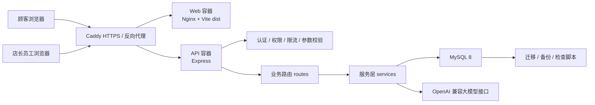
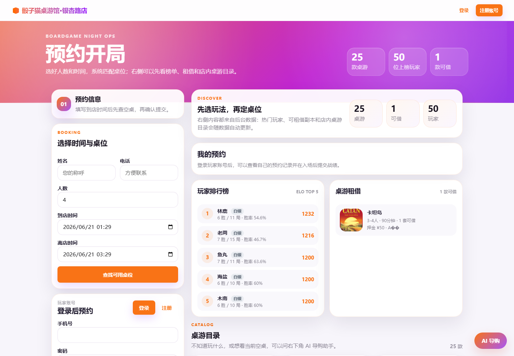
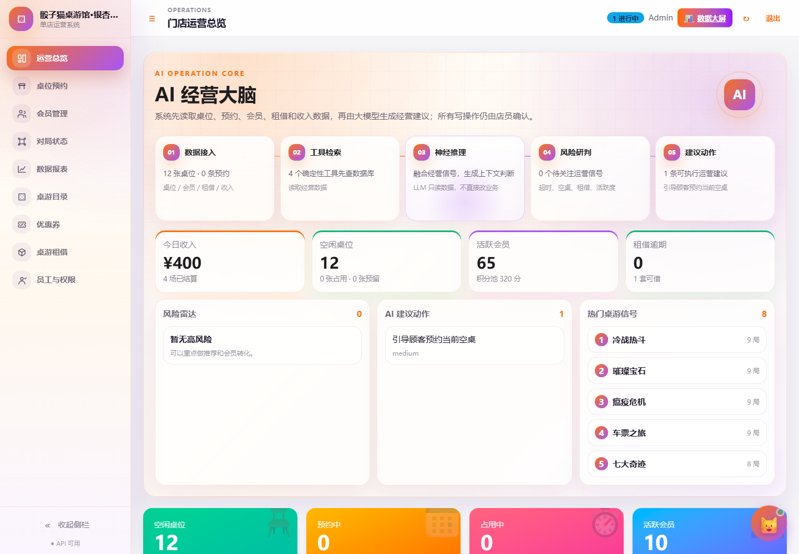
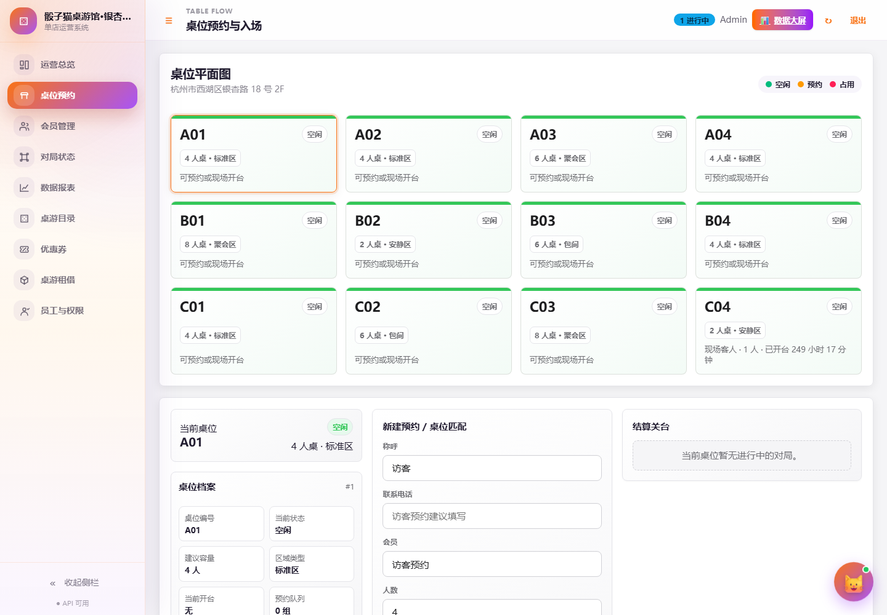
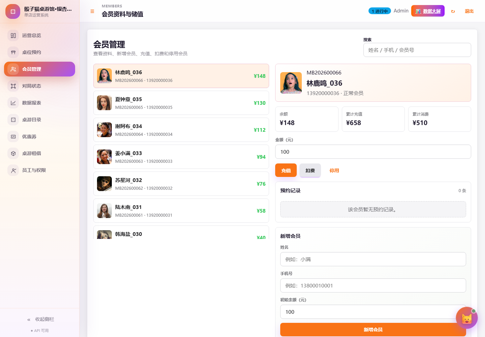
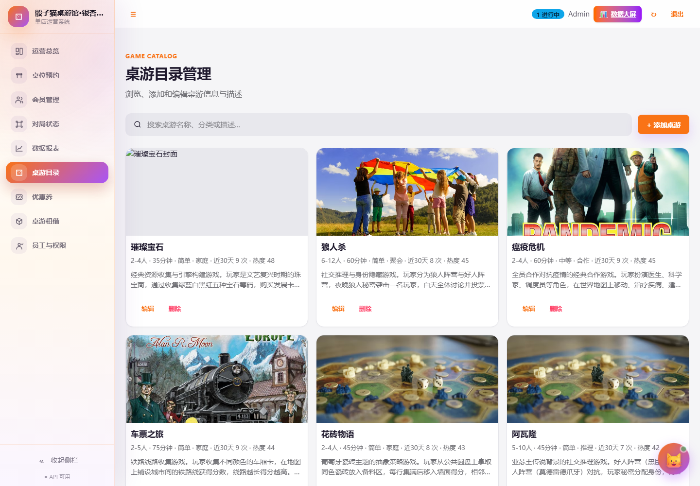
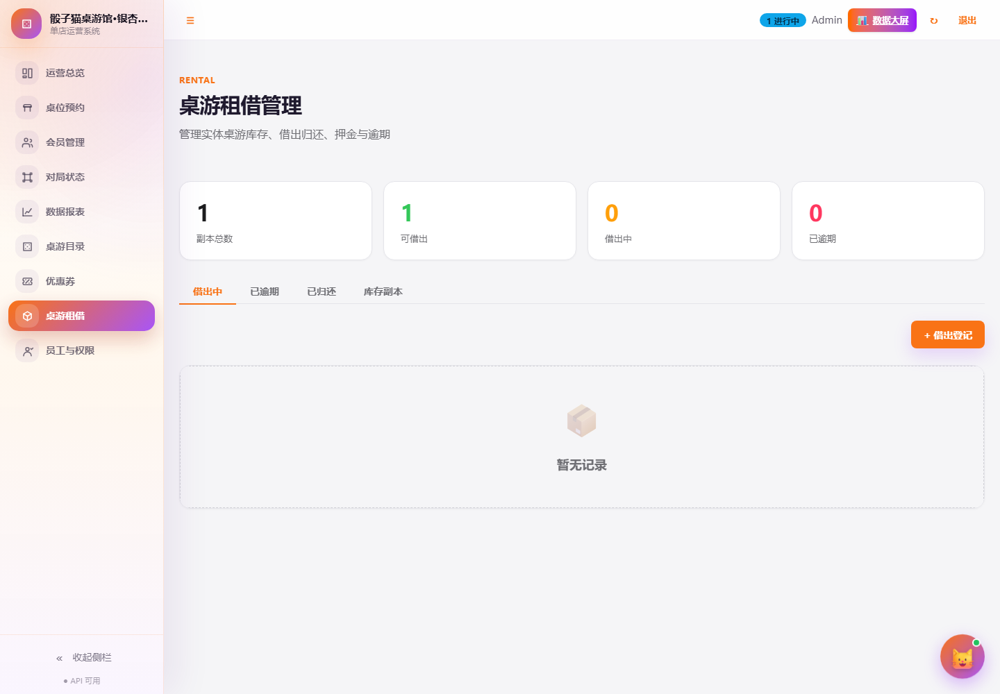
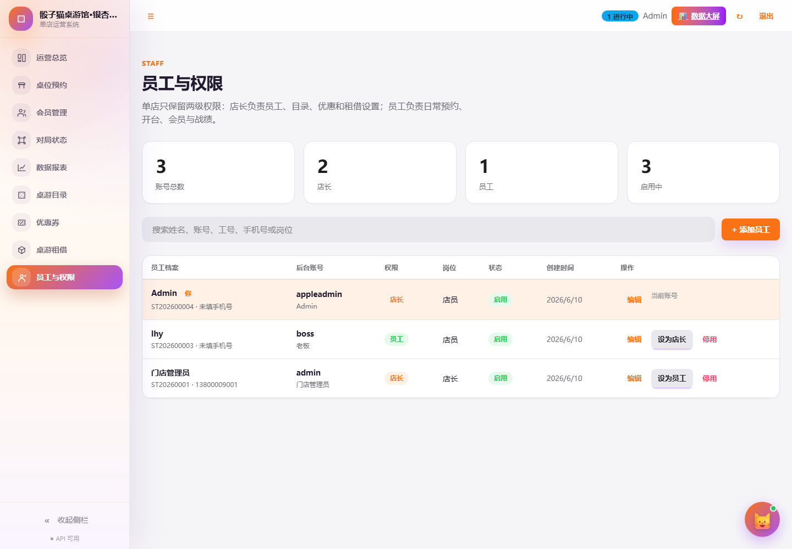
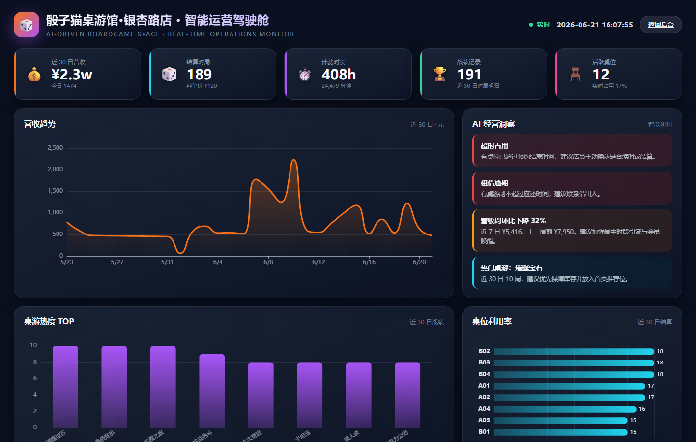

# 骰子猫桌游馆系统产品功能说明书

## 1. 项目基本信息

项目名称：骰子猫桌游馆系统
项目类型：单店版桌游馆经营管理系统
部署方式：云服务器公网部署 + Docker Compose 编排
技术栈：Express + Vanilla JS/Vite + Tailwind/DaisyUI + MySQL + Docker/Caddy
当前定位：面向单店经营，覆盖顾客预约、员工运营、店长管理、数据分析和 AI 辅助决策。

公网访问地址：

| 入口 | 地址 | 用途 |
| --- | --- | --- |
| 顾客端首页 | `https://lhywork.top/` | 顾客预约、登录、查看桌游目录、租借、排行榜、AI 导购 |
| 后台入口 | `https://lhywork.top/admin` | 店长和员工登录后台 |
| 数据大屏 | `https://lhywork.top/admin#/screen` | 全屏经营数据展示，需要后台登录态 |
| 健康检查 | `https://lhywork.top/api/health` | 检查 API、数据库、迁移和 AI 配置状态 |

演示账号：

| 类型 | 账号 | 密码 | 说明 |
| --- | --- | --- | --- |
| 顾客账号 | `19900061001` | `demo12345` | 用于演示顾客登录、我的预约和战绩 |
| 后台账号 | 使用服务器已有店长账号 | 使用服务器已有密码 | 用于演示后台运营功能 |

## 2. 系统定位

这个项目围绕桌游馆的真实单店经营流程展开。顾客在线提交预约，员工在后台处理到店和开台，店长通过总览、报表和数据大屏查看经营情况。桌游目录、租借副本、会员积分、订单计费和战绩记录统一落到 MySQL 数据库中，页面展示和 AI 分析都从后端读取数据。

系统当前不接真实支付、短信和微信小程序。这样做的原因是答辩阶段重点放在可运行的单店闭环、数据库设计、后台权限、AI 工具层和公网部署上，减少外部资质和第三方接口对演示稳定性的影响。

## 3. 总体架构



线上容器：

| 容器 | 作用 |
| --- | --- |
| `caddy` | 对外提供 80/443，处理 HTTPS 和反向代理 |
| `web` | 提供构建后的前端静态资源 |
| `api` | 运行 Express 后端接口 |
| `boardgame-mysql` | 保存业务数据，使用 Docker volume 持久化 |

后端结构：

```text
server/src/
  index.js                 Express 入口，负责中间件、静态挂载和监听
  routes/                  按业务域拆分 API
  services/                预约维护、AI 经营快照、规则检索等服务逻辑
  auth.js                  员工和顾客登录态解析
  security.js              token 哈希、密码 scrypt 哈希
  audit.js                 关键写操作审计
  db.js                    MySQL 连接池
  seed-presentation.js     答辩演示数据补齐脚本
```

前端结构：

```text
web/src/
  main.js                  SPA 页面、路由和事件绑定
  screen.js                数据大屏页面和 ECharts 图表
  api.js                   请求封装
  state.js                 全局状态
  app-data.js              页面配置和导航配置
  components/              Toast 等通用组件
  styles.css               页面样式和大屏样式
```

数据库与运维脚本：

```text
db/init/                   空库初始化：表、过程、视图、种子数据
db/migrations/             后续结构变更迁移
scripts/db-check.mjs       检查关键表、字段、视图、存储过程
scripts/db-backup.mjs      导出数据库备份
scripts/predeploy-check.mjs 部署前检查
deploy/docker-compose.prod.yml 生产环境编排
deploy/Caddyfile           HTTPS 和反向代理配置
```

## 4. 顾客端功能

### 4.1 顾客预约首页

顾客访问 `https://lhywork.top/` 后直接进入预约页面。页面左侧是预约和登录区域，右侧展示排行榜、租借、桌游目录和 AI 导购入口。



主要功能：

- 填写姓名、手机号、人数、到店时间、离店时间。
- 查询可用桌位。
- 查看玩家排行榜。
- 查看可租借桌游。
- 浏览店内桌游目录。
- 使用 AI 导购询问空桌和推荐桌游。

后端支撑：

- `POST /api/public/reservations`：提交顾客预约。
- `GET /api/tables`：读取桌位状态。
- `GET /api/leaderboard`：读取排行榜。
- `GET /api/public/rental/games`：读取可租借桌游。
- `POST /api/public/ai/guide`：顾客 AI 导购。

数据库落点：

- `reservations`：预约记录。
- `game_tables`、`game_table_state`：桌位基础信息和实时状态。
- `players`、`player_stats`：会员和排行榜。
- `games`、`game_copies`、`game_loans`：桌游目录和租借信息。

### 4.2 顾客账号、我的预约和战绩

顾客可以注册、登录、查看自己的预约记录，并围绕自己的预约提交战绩。

实现规则：

- 顾客使用手机号登录。
- 密码在后端使用 scrypt 哈希保存。
- 登录态存在 `player_sessions` 表，接口通过 Bearer Token 识别顾客。
- 顾客只能查看自己的预约。
- 战绩提交时校验预约归属、场次状态和重复提交。

相关接口：

- `POST /api/public/auth/register`
- `POST /api/public/auth/login`
- `GET /api/public/me/reservations`
- `POST /api/public/me/reservations/:id/records`

数据库表：

- `players`
- `player_sessions`
- `reservations`
- `play_sessions`
- `game_records`

### 4.3 顾客 AI 导购

顾客 AI 导购用于回答“几个人适合玩什么”“现在有没有空桌”“新手适合哪款桌游”这类问题。

处理流程：

1. 后端读取当前桌位状态。
2. 根据人数筛选适合的桌游。
3. 读取近期热门桌游和规则资料。
4. 把确定性数据交给大模型组织成自然语言。
5. 返回推荐桌游、可用桌位和下一步提示。

边界：

- AI 可以推荐桌游和桌位。
- AI 可以解释推荐理由。
- AI 不直接替顾客提交预约。
- 最终预约必须由顾客点击页面按钮完成。

## 5. 后台运营功能

### 5.1 运营总览和 AI 经营大脑

后台首页用于店长查看当天经营状态。页面展示今日收入、空桌数量、预约情况、活跃会员、租借逾期、热门桌游和 AI 建议。



数据来源：

- 今日收入：`orders`、`play_sessions`
- 桌位状态：`game_table_state`
- 预约和进行中场次：`reservations`、`play_sessions`
- 活跃会员：`players`
- 租借逾期：`game_loans`
- 热门桌游：`game_records`

AI 经营大脑接口：

- `GET /api/ai/dashboard-snapshot?days=30`
- `POST /api/ai/agent`

AI 经营大脑读取经营快照后，生成风险提示和建议动作。建议可以指向具体后台页面，例如租借逾期、桌位处理、热门桌游补货等。写操作仍由店长或员工在页面中确认。

### 5.2 桌位预约与入场

桌位模块用于处理预约、到店、开台、进行中场次和超时提醒。



主要流程：

1. 顾客或员工创建预约。
2. 后端检查桌位容量和预约时间冲突。
3. 预约到店后，员工点击入场。
4. 系统创建 `play_sessions` 开台记录。
5. 进行中的场次进入对局状态。
6. 结算后生成订单、积分和消费记录。

核心数据库操作：

- `sp_reserve_table`：检查冲突并创建预约。
- `sp_checkin_start_session`：预约入场并创建开台记录。
- `sp_start_walkin_session`：现场开台。
- `sp_end_session_settle`：结束场次并结算。
- `game_table_state`：记录桌位当前状态。

### 5.3 会员管理

会员管理用于维护会员资料、余额、积分、等级、储值和消费。



功能：

- 查看会员列表。
- 新增会员。
- 会员充值。
- 会员扣费。
- 查询会员预约记录。
- 根据累计消费更新等级。

相关表：

- `players`
- `points_logs`
- `orders`
- `order_items`

后台接口：

- `GET /api/members`
- `POST /api/members`
- `POST /api/members/:id/recharge`
- `POST /api/members/:id/consume`
- `GET /api/members/:id/reservations`

### 5.4 桌游目录管理

桌游目录是顾客端、后台端和 AI 推荐共同使用的数据源。



可维护字段：

- 桌游名称。
- 封面图片 URL。
- 分类。
- 人数范围。
- 平均时长。
- 难度。
- 详细描述。
- 出版信息。
- 推荐权重。

相关表：

- `games`
- `game_records`
- `game_rules_corpus`

热度计算：

- 桌游热度来自 `game_records` 中的近期对局记录。
- 数据报表和数据大屏通过 `sp_report_game_popularity` 读取热度排行。
- AI 导购会读取桌游人数范围、类别、时长、近期热度和规则知识。

### 5.5 桌游租借

租借模块管理实体桌游副本，适合桌游馆“带回家玩”的业务。



功能：

- 新增和维护实体副本。
- 记录副本条码、位置、押金和品相。
- 借出桌游。
- 归还桌游。
- 标记逾期和丢失。
- 在运营总览和 AI 经营快照中提示逾期风险。

相关表：

- `game_copies`
- `game_loans`
- `games`
- `players`

核心接口：

- `GET /api/rental/stats`
- `GET /api/rental/copies`
- `POST /api/rental/copies`
- `GET /api/rental/loans`
- `POST /api/rental/loans`
- `POST /api/rental/loans/:id/return`

### 5.6 员工与权限

后台保留两级角色：店长和员工。



角色边界：

| 角色 | 能力 |
| --- | --- |
| 店长 | 管理员工、角色、桌游目录、租借副本、优惠券和关键资产 |
| 员工 | 处理预约、开台、会员基础操作和租借借还 |

安全处理：

- 后端接口统一校验角色。
- 当前登录店长不能把自己降级。
- 最后一个店长不能被停用或降级。
- 员工不能进入权限管理能力。

相关表：

- `staff_profiles`
- `app_users`
- `auth_sessions`
- `audit_logs`

## 6. 数据报表与数据大屏

### 6.1 数据报表

后台数据报表用于查看经营趋势、桌游热度和桌位利用率。报表数据由存储过程和聚合 SQL 提供。

核心接口：

- `GET /api/reports/revenue?date=YYYY-MM-DD`
- `GET /api/reports/revenue-trend?days=30`
- `GET /api/reports/game-popularity?days=30`
- `GET /api/reports/table-utilization?days=30`

核心存储过程：

- `sp_report_daily_revenue`
- `sp_report_game_popularity`
- `sp_report_table_utilization`

### 6.2 数据大屏

数据大屏入口：`https://lhywork.top/admin#/screen`



大屏内容：

- 顶部 KPI：近 30 日营收、结算对局、计费时长、战绩记录、活跃桌位。
- 营收趋势：按天展示最近 30 天结算收入。
- AI 经营洞察：结合风险队列、营收趋势、热门桌游、冷门桌位生成文字建议。
- 桌游热度 TOP：根据近期战绩记录统计。
- 桌位利用率：根据近期结算场次统计。

前端实现：

- 文件：`web/src/screen.js`
- 图表：ECharts
- 布局：独立全屏深色大屏布局
- 实时感：页面显示实时钟
- 性能处理：离开大屏时释放 ECharts 实例，避免重复 resize 监听

后端数据：

- `/api/reports/revenue-trend`
- `/api/reports/game-popularity`
- `/api/reports/table-utilization`
- `/api/ai/dashboard-snapshot`

## 7. 数据库设计与操作

### 7.1 核心表

| 模块 | 表 | 说明 |
| --- | --- | --- |
| 门店 | `venues` | 门店基础信息 |
| 员工 | `staff_profiles`、`app_users`、`auth_sessions` | 员工档案、后台账号、后台登录态 |
| 顾客会员 | `players`、`player_sessions`、`player_stats` | 顾客资料、顾客登录态、排行榜统计 |
| 桌位 | `game_tables`、`game_table_state` | 桌位信息和实时状态 |
| 预约开台 | `reservations`、`play_sessions` | 预约、到店、开台和结算 |
| 战绩 | `game_records`、`game_record_participants` | 对局结果和参与者 |
| 桌游 | `games`、`game_rules_corpus` | 桌游目录和规则知识库 |
| 租借 | `game_copies`、`game_loans` | 实体副本和借还记录 |
| 订单营销 | `orders`、`order_items`、`points_logs`、`coupons`、`member_coupons` | 结算、积分、优惠券 |
| 运维审计 | `audit_logs`、`schema_migrations`、`ai_interactions` | 审计、迁移记录、AI 交互记录 |

### 7.2 初始化与迁移

空库初始化目录：

```text
db/init/01_schema.sql
db/init/02_procedures.sql
db/init/03_seed.sql
db/init/04_views.sql
db/init/05_bulk_seed.sql
db/init/06_security_grants.sql
db/init/07_run_migrations.sh
```

迁移目录：

```text
db/migrations/
```

迁移记录表：

```text
schema_migrations
```

`07_run_migrations.sh` 会读取迁移文件，已执行的迁移不会重复执行。执行失败时脚本退出，避免静默跳过错误。

服务器执行迁移：

```bash
cd /opt/boardgame-system
docker compose -f deploy/docker-compose.prod.yml --env-file deploy/.env.prod exec -T mysql bash /docker-entrypoint-initdb.d/07_run_migrations.sh
```

### 7.3 数据检查

本地或服务器容器内可以执行：

```bash
npm run db:check
```

检查内容：

- 关键表是否存在。
- 关键字段是否存在。
- 关键视图是否存在。
- 关键存储过程是否存在。

### 7.4 数据备份

备份命令：

```bash
npm run db:backup
```

脚本会使用当前数据库配置导出 MySQL 数据。备份文件名包含日期和 Git commit，方便回滚时确认版本。

### 7.5 演示数据补齐

为了录制答辩视频，项目提供了可重复运行的演示数据脚本：

```bash
npm run demo:seed
```

服务器容器内执行：

```bash
docker compose -f deploy/docker-compose.prod.yml --env-file deploy/.env.prod exec api npm run demo:seed
```

脚本会补齐：

- 8 个完整会员。
- 6 款用于展示的桌游信息。
- 今日进行中的桌位。
- 即将到店的预约。
- 今日已结算收入。
- 热门桌游战绩。
- 可借、借出和逾期的租借副本。
- AI 交互审计样例。

脚本特点：

- 不清空数据库。
- 不执行 force reset。
- 使用固定会员号、手机号、条码和 `presentation-demo` 标记。
- 可以在录制前重复运行，让页面数据保持充足。

## 8. 安全与权限

已实现的安全处理：

- 后台和顾客密码使用 scrypt 哈希。
- token 只在数据库中保存哈希。
- 员工接口使用 `requireAuth`。
- 店长接口使用 `requireTenantAdmin`。
- 登录、注册等接口有限流。
- Helmet 提供基础 HTTP 安全头。
- Zod 用于关键参数校验。
- 审计日志记录关键写操作。

审计日志覆盖：

- 员工和权限修改。
- 会员充值和扣费。
- 桌位结算。
- 桌游删除。
- 租借归还。
- 其他关键写请求。

## 9. AI 模块

AI 模块分为顾客导购和后台经营分析。

顾客导购：

- 接口：`POST /api/public/ai/guide`
- 数据：空桌、桌游目录、热门桌游、规则资料。
- 输出：推荐桌游、可用桌位、推荐理由、下一步提示。

后台经营大脑：

- 接口：`GET /api/ai/dashboard-snapshot?days=30`
- 接口：`POST /api/ai/agent`
- 数据：桌位、预约、会员、订单、租借、热门桌游、风险队列。
- 输出：经营摘要、风险提示、建议动作、工具调用结果。

AI 边界：

- AI 只读取允许的数据。
- AI 生成建议和解释。
- AI 不直接执行预约、取消、结算、改账号、改权限等写操作。
- 业务写入必须由用户点击页面按钮完成。

## 10. 部署与更新

服务器更新：

```bash
cd /opt/boardgame-system
git pull origin main
docker compose -f deploy/docker-compose.prod.yml --env-file deploy/.env.prod up -d --build
```

查看容器：

```bash
docker compose -f deploy/docker-compose.prod.yml --env-file deploy/.env.prod ps
```

查看 API 日志：

```bash
docker compose -f deploy/docker-compose.prod.yml --env-file deploy/.env.prod logs --tail=80 api
```

部署前检查：

```bash
npm run deploy:check
```

本地构建：

```bash
npm run build -w web
```

后端测试：

```bash
npm test -w server
```

## 11. 功能清单

顾客端：

- 首页预约。
- 顾客注册登录。
- 我的预约。
- 战绩提交。
- AI 导购。
- 玩家排行榜。
- 桌游租借。
- 桌游目录。

后台端：

- 运营总览。
- AI 经营大脑。
- 桌位预约。
- 对局状态。
- 会员管理。
- 优惠券。
- 订单与计费。
- 数据报表。
- 数据大屏。
- 桌游目录。
- 桌游租借。
- 员工与权限。

工程能力：

- 公网 HTTPS 访问。
- Docker Compose 部署。
- MySQL 持久化。
- 数据库初始化和迁移。
- 健康检查。
- 数据库检查。
- 数据库备份。
- 审计日志。
- 登录限流。
- 参数校验。
- 演示数据脚本。

## 12. 总结

当前系统已经形成单店桌游馆的主要业务闭环：顾客从公网首页预约，员工在后台处理到店和开台，店长查看运营总览、报表和数据大屏。数据库保存会员、桌位、预约、战绩、租借、订单和审计数据。AI 模块通过后端工具读取经营数据，提供导购和经营建议。

项目可以在云服务器上通过 Docker Compose 部署，具备健康检查、迁移、备份、测试和演示数据补齐脚本。整体结构适合课程答辩展示，也方便后续继续扩展支付、小程序、短信通知等外部能力。
