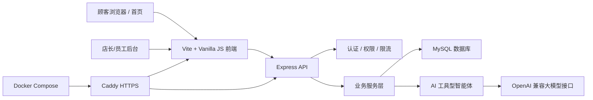

# 骰子猫桌游馆系统产品功能说明书

## 1. 产品定位

骰子猫桌游馆系统是一套面向单店经营场景的桌游馆管理平台，覆盖顾客预约、会员管理、桌位运营、桌游目录、租借服务、员工权限、数据报表和 AI 经营分析。

当前版本的目标不是做复杂多租户 SaaS，而是把一个真实门店需要的核心流程做成可部署、可维护、可演示的单体系统。系统既能给顾客使用，也能给店长和员工处理日常运营。

## 2. 技术架构



核心技术栈：

- 前端：Vanilla JS + Vite + Tailwind/DaisyUI + ECharts
- 后端：Express + MySQL2 + Zod + Helmet + express-rate-limit + Pino
- 数据库：MySQL 8，包含初始化脚本、迁移脚本、视图和存储过程
- 部署：Docker Compose + Caddy + Web + API + MySQL
- 运维：健康检查、迁移记录、数据库检查、备份脚本、部署检查脚本

## 3. 顾客端功能

### 3.1 顾客预约首页

顾客访问网站根路径即可进入预约页面。页面提供预约信息填写、玩家登录、我的预约、玩家排行榜、桌游租借和桌游目录入口。预约数据会根据后端桌位、容量、预约冲突和时间信息进行判断。


实现要点：

- 预约表单包含姓名、电话、人数、到店时间、离店时间。
- 后端根据人数和预约时段查询可用桌位。
- 登录后的顾客可以查看自己的预约记录。
- 桌游目录、排行榜、租借数据来自数据库。
- AI 导购只提供建议，不直接替用户提交预约。

### 3.2 顾客账号与战绩

顾客可以注册账号、登录并查看自己的预约。战绩填写从后台复杂流程中拆出，改为由顾客在自己的界面提交，避免“没有预约也能写战绩”的问题。

实现要点：

- 顾客注册会写入会员账号和基础手机号信息。
- 顾客只能访问自己的预约和战绩记录。
- 战绩提交与预约记录关联，防止无预约随意写入。

## 4. 后台运营功能

### 4.1 AI 经营大脑与运营总览

后台首页汇总收入、空闲桌位、活跃会员、租借逾期、热门桌游、风险提示和建议动作。AI 经营大脑先读取确定性数据库数据，再调用大模型生成经营分析，因此不是纯聊天装饰。


实现要点：

- 经营快照来自桌位、预约、会员、租借、订单和游戏热度数据。
- AI 只读经营数据，不直接执行结算、预约、改账号等写操作。
- 风险提示包含超时、空桌、租借逾期和会员活跃度。
- 建议动作以运营建议形式返回，由店长或员工确认执行。

### 4.2 桌位预约与入场

桌位页面用于员工处理预约、开台、入场和结算前的运营状态。系统区分空闲、预约中、占用中和超时队列，减少桌位冲突。


实现要点：

- 桌位状态由数据库记录，不依赖前端临时状态。
- 预约冲突和人数容量由后端校验。
- 超时预约进入提醒队列，不强制自动结束。
- 员工可以处理日常预约和开台流程。

### 4.3 会员管理

会员管理用于维护门店会员资料、积分、等级、储值和消费记录。当前为了保证数据质量，会员记录已规整，只保留信息较完整的会员作为演示数据。


实现要点：

- 新注册顾客会生成完整会员号、手机号等基础信息。
- 会员等级、积分和储值流水在后端统一处理。
- 关键扣费、充值、结算操作进入审计日志。

### 4.4 桌游目录管理

桌游目录用于维护门店可玩的桌游，包括名称、分类、人数范围、时长、难度、描述、封面和热度。目录数据放在后端数据库中，顾客端和后台共用同一份数据。


实现要点：

- 支持新增、编辑、删除桌游。
- 支持封面图片 URL、游戏描述、人数、时长、难度等字段。
- 热度由数据库中的近期游玩和租借数据计算。
- 顾客端目录采用展开/收起，避免页面过长影响预约栏浏览。

### 4.5 桌游租借

租借服务管理桌游副本、借出、归还和逾期提醒。租借功能把桌游馆常见的“带回家玩”场景纳入系统，而不是只做店内预约。


实现要点：

- 每个可租借桌游可以有多个副本。
- 借出和归还会改变副本状态。
- 逾期租借进入运营总览风险提示。
- 员工可处理借出归还，店长可管理副本资产。

### 4.6 员工与权限

员工与权限页面整合员工管理和权限管理，只保留店长与员工两级角色，避免权限模型过度复杂。


实现要点：

- 店长可以新增员工、启停账号、调整角色。
- 员工负责预约、开台、会员基础操作。
- 后端统一做角色校验，不能只靠前端按钮隐藏。
- 防止当前登录店长误操作导致自己失去店长权限。

## 5. AI 能力边界

AI 模块的定位是“经营辅助”和“顾客导购”，不是自动操作员。

AI 可以做：

- 查询当前空桌情况。
- 根据人数、时间、偏好推荐桌游和桌位。
- 总结热门桌游、租借逾期、会员活跃和运营风险。
- 给店长生成经营建议和操作草稿。

AI 不可以做：

- 直接替顾客提交预约。
- 直接取消预约或结算。
- 直接修改员工权限、会员储值或账号信息。
- 声称“已经帮你预约成功”。

这个边界设计可以避免大模型幻觉造成真实业务数据错误。

## 6. 工程化能力

系统除了业务页面，还补齐了企业级项目常见的工程能力：

- API 分层：路由、服务、认证、安全、日志拆分。
- 参数校验：使用 Zod 校验关键请求。
- 安全加固：Helmet、登录限流、Bearer Token、密码哈希。
- 审计日志：记录员工权限、会员扣费、桌位结算、租借归还等关键写操作。
- 数据库迁移：通过 `schema_migrations` 记录迁移执行状态。
- 数据库备份：支持按日期和 Git commit hash 导出备份。
- 健康检查：`/api/health` 返回 API、DB、迁移和 AI 配置状态。
- 部署检查：部署前校验环境变量、数据库连接、迁移和前端构建产物。

## 7. 运行与部署

本地运行：

```bash
npm install
npm run build -w web
npm run start -w server
```

生产部署：

```bash
cd /opt/boardgame-system
git pull origin main
docker compose -f deploy/docker-compose.prod.yml --env-file deploy/.env.prod up -d --build
```

常用检查：

```bash
npm test -w server
npm run db:check
npm run deploy:check
curl http://127.0.0.1:8788/api/health
```

## 8. 当前版本总结

当前系统已经具备完整单店经营闭环：

- 顾客可以注册、登录、预约、查看记录、浏览桌游和咨询 AI。
- 员工可以处理桌位、会员、租借和日常运营。
- 店长可以维护桌游目录、员工权限、经营数据和风险提示。
- AI 与数据库结合，提供导购和经营建议，但不越权写业务数据。
- 项目具备构建、部署、迁移、备份、健康检查和测试入口。

这使项目从普通页面演示提升为一个有业务深度、工程结构和答辩亮点的桌游馆经营系统。
